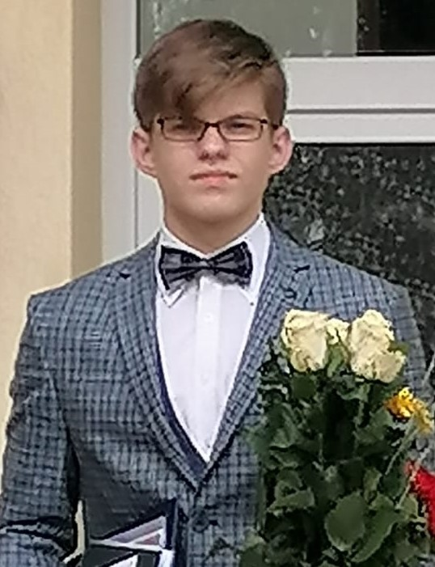

# 
CV

## Vārds, Uzvārds: Edgars Bērziņš
## E-pasts: edgarsberzins100@gmail.com
## Talr.: +37123304802
## Dzimšanas datums:2004.08.18
###### 

## Raksturojums
### 
*Esmu 16 gadus vecs skolnieks, kas mācās PIKC Rīgas Valsts tehnikumā. Mācos par programmētāju, jo vienmēr ir interesējis kā strādā visādas programmas un spēles datorā. Šobrid personīgi nevaru teikt ka zinu kā programmēt vai ka zinu kādu programmēšanas valodu, jo esmu tikai iesācējs un mācos pēc iespējas vairāk, lai kļūtu par labu programmētāju.*

## Izglītība
### __2010.g. - 2020.g. - **Ķeguma komercnovirziena vidusskola.__
### __2020.g. - Šai dienai - **PIKC Rīgas Valsts Tehnikums.__

## Sasniegumi

### - _Esmu ieguvis 2.vietu Bebr[a]s informātikas konkursā_
### - _Esmu ieguvis 2.vietu Ogres Novada informātikas olimpiādē_ 
### - _Esmu ieguvis 3. vietu RIMS meridiāns matemātikas olimpiādē_

## Hobiji

### 1. Spēlēju ģitāru un klavieres.
### 2. Nodarbojos ar svarcelšanu un ielas vingrošanu.
### 3. Nodarbojos ar attēlu rediģēšanu **Photoshop**.
### 4. Video montēšana.

## Pieredze Programmēšana
### Programmēšanu sāku mācīties uzsākot mācības RVT.
### No programmēšanas valodām nedaudz zinu Python un Java.